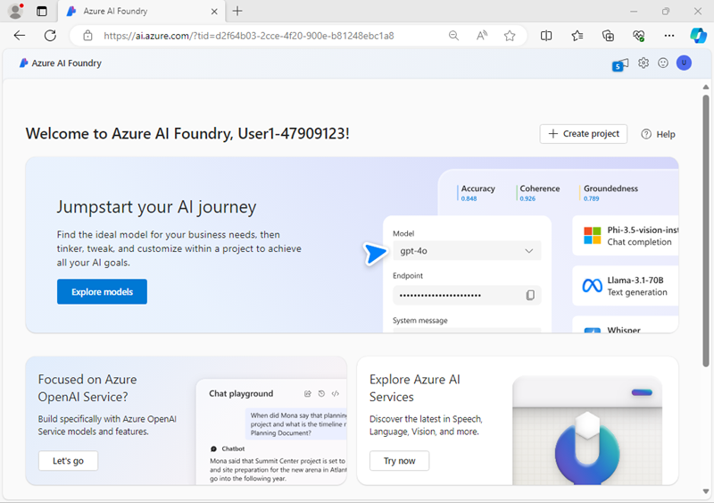

---
lab:
  title: 오디오 지원 채팅 앱 개발
  description: Azure AI 파운드리를 사용하여 오디오 입력을 지원하는 생성형 AI 앱을 빌드하는 방법을 알아봅니다.
---

# 오디오 지원 채팅 앱 개발

이 연습에서는 *Phi-4-multimodal-instruct* 생성형 AI 모델을 사용하여 오디오 파일을 포함하는 프롬프트에 대한 응답을 생성합니다. 고객이 남긴 음성 메시지를 요약하는 Azure AI Foundry 및 Python OpenAI SDK를 사용하여 농산물 공급업체에 AI 지원을 제공하는 앱을 개발합니다.

이 연습은 Python을 기반으로 하지만 여러 언어별 SDK를 사용하여 유사한 애플리케이션을 개발할 수 있습니다. 포함 사항:

- [Python용 Azure AI 프로젝트](https://pypi.org/project/azure-ai-projects)
- [Python용 OpenAI 라이브러리](https://pypi.org/project/openai/)
- [Microsoft .NET용 Azure AI 프로젝트](https://www.nuget.org/packages/Azure.AI.Projects)
- [Microsoft .NET용 Azure OpenAI 클라이언트 라이브러리](https://www.nuget.org/packages/Azure.AI.OpenAI)
- [JavaScript용 Azure AI 프로젝트](https://www.npmjs.com/package/@azure/ai-projects)
- [TypeScript용 Azure OpenAI 라이브러리](https://www.npmjs.com/package/@azure/openai)

이 연습에는 약 **30**분이 소요됩니다.

## Azure AI 파운드리 프로젝트 만들기

Azure AI 파운드리 프로젝트에 모델을 배포하는 것부터 시작해 보겠습니다.

1. 웹 브라우저에서 [Azure AI 파운드리 포털](https://ai.azure.com)(`https://ai.azure.com`)을 열고 Azure 자격 증명을 사용하여 로그인합니다. 처음 로그인할 때 열리는 팁이나 빠른 시작 창을 닫고 필요한 경우 왼쪽 위에 있는 **Azure AI 파운드리** 로고를 사용하여 다음 이미지와 유사한 홈 페이지로 이동합니다.

    

1. 홈페이지의 **모델 및 기능 탐색** 섹션에서 `Phi-4-multimodal-instruct` 모델을 검색합니다. 이 모델은 프로젝트에서 사용할 것입니다.
1. 검색 결과에서 **Phi-4-multimodal-instruct** 모델을 선택하여 세부 정보를 확인한 다음, 해당 모델 페이지 상단에서 **이 모델 사용**을 선택합니다.
1. 프로젝트를 만들라는 메시지가 표시되면 프로젝트의 유효한 이름을 입력하고 **고급 옵션**을 펼칩니다.
1. **사용자 지정**을 선택하고 허브에 대해 다음 설정을 지정합니다.
    - **Azure AI 파운드리 리소스**: *Azure AI 파운드리 리소스의 유효한 이름*
    - **구독**: ‘Azure 구독’
    - **리소스 그룹**: ‘리소스 그룹 만들기 또는 선택’
    - **지역**: ***AI Foundry 권장 사항 선택***\*

    > \* 일부 Azure AI 리소스는 지역 모델 할당량에 의해 제한됩니다. 연습 후반부에 할당량 한도를 초과하는 경우 다른 지역에서 다른 리소스를 만들어야 할 수도 있습니다. [Azure AI 파운드리 설명서](https://learn.microsoft.com/azure/ai-foundry/how-to/deploy-models-serverless-availability#region-availability)에서 특정 모델에 대한 최신 지역 가용성을 확인할 수 있습니다.

1. **만들기**를 선택한 다음, 프로젝트가 만들어질 때까지 기다립니다.

    작업을 완료하는 데 몇 분 정도 걸릴 수 있습니다.

1. **동의 후 계속**을 선택하여 모델 조건에 동의한 다음, **배포**를 선택하여 Phi 모델 배포를 완료합니다.

1. 프로젝트를 만들면 모델 세부 정보가 자동으로 열립니다. 모델 배포의 이름을 확인합니다. 이 이름은**Phi-4-multimodal-instruct**여야 합니다.

1. 왼쪽 탐색 창에서 **개요**를 선택하면 다음과 같은 프로젝트의 메인 페이지가 표시됩니다.

    > **참고**: *권한 부족** 오류가 표시되면 **수정** 버튼을 사용하여 문제를 해결합니다.

    

## 클라이언트 애플리케이션 생성하기

이제 모델을 배포했으므로 Azure AI 파운드리 및 Azure AI 모델 추론 SDK를 사용하여 이 모델과 채팅하는 애플리케이션을 개발할 수 있습니다.

> **팁**: Python 또는 Microsoft C#을 사용하여 솔루션을 개발하도록 선택할 수 있습니다. 선택한 언어의 해당 섹션에 있는 지침을 따릅니다.

### 애플리케이션 구성 준비

1. Azure AI 파운드리 포털에서 프로젝트의 **개요** 페이지를 봅니다.
1. **프로젝트 세부 정보** 영역에서 **Azure AI 파운드리 프로젝트 엔드포인트**에 주목합니다. 이 엔드포인트를 사용하여 클라이언트 응용 프로그램에서 프로젝트에 연결할 수 있습니다.
1. 새 브라우저 탭을 엽니다(Azure AI 파운드리 포털을 기존 탭에서 열어 두기). 그런 다음 새 탭에서 [Azure Portal](https://portal.azure.com)(`https://portal.azure.com`)을 열고 메시지가 나타나면 Azure 자격 증명을 사용하여 로그인합니다.

    Azure Portal 홈페이지를 보려면 환영 알림을 닫습니다.

1. 페이지 상단의 검색 창 오른쪽에 있는 **[\>_]** 단추를 사용하여 Azure Portal에서 새 Cloud Shell을 만들고 구독에 저장소가 없는 ***PowerShell*** 환경을 선택합니다.

    Cloud Shell은 Azure Portal 하단의 창에서 명령줄 인터페이스를 제공합니다. 보다 쉽게 작업할 수 있도록 이 창의 크기를 조정하거나 최대화할 수 있습니다.

    > **참고**: 이전에 *Bash* 환경을 사용하는 Cloud Shell을 만든 경우 ***PowerShell***로 전환합니다.

1. Cloud Shell 도구 모음의 **설정** 메뉴에서 **클래식 버전으로 이동**을 선택합니다(코드 편집기를 사용하는 데 필요).

    **<font color="red">계속하기 전에 Cloud Shell의 클래식 버전으로 전환했는지 확인합니다.</font>**

1. Cloud Shell 창에서 다음 명령을 입력하여 이 연습의 코드 파일이 포함된 GitHub 리포지토리를 복제합니다(명령을 입력하거나 클립보드에 복사한 다음 명령줄을 마우스 오른쪽 단추로 클릭하여 일반 텍스트로 붙여넣습니다).

    ```
   rm -r mslearn-ai-audio -f
   git clone https://github.com/MicrosoftLearning/mslearn-ai-language
    ```

    > **팁**: CloudShell에 명령을 붙여넣을 때, 출력이 화면 버퍼의 많은 부분을 차지할 수 있습니다. `cls` 명령을 입력해 화면을 지우면 각 작업에 더 집중할 수 있습니다.

1. 리포지토리가 복제된 후 애플리케이션 코드 파일이 포함된 폴더로 이동합니다.  

    ```
   cd mslearn-ai-language/Labfiles/09-audio-chat/Python
    ````

1. Cloud Shell 명령줄 창에서 다음 명령을 입력하여 사용할 라이브러리를 설치합니다.

    ```
   python -m venv labenv
   ./labenv/bin/Activate.ps1
   pip install -r requirements.txt azure-identity azure-ai-projects openai
    ```

1. 제공된 구성 파일을 편집하려면 다음 명령을 입력합니다.

    ```
   code .env
    ```

    코드 편집기에서 파일이 열립니다.

1. 코드 파일에서 **your_project_endpoint** 자리 표시자를 프로젝트의 연결 문자열(Azure AI 파운드리 포털의 프로젝트 **개요** 페이지에서 복사)로 바꾸고 **your_model_deployment** 자리 표시자를 Phi-4-multimodal-instruct 모델 배포에 할당한 이름으로 바꿉니다.

1. 자리 표시자를 바꾼 후 코드 편집기에서 **CTRL+S** 명령 또는 **마우스 오른쪽 단추 클릭 > 저장**을 사용하여 변경 내용을 저장한 다음 **CTRL+Q** 명령 또는 **마우스 오른쪽 단추 클릭 > 종료**를 사용하여 Cloud Shell 명령줄을 열어둔 채 코드 편집기를 닫습니다.

### 프로젝트에 연결하고 모델에 대한 채팅 클라이언트를 가져오는 코드를 작성합니다.

> **팁**: 코드를 추가할 때 올바른 들여쓰기를 유지해야 합니다.

1. 다음 명령을 입력하여 코드 파일을 편집합니다.

    ```
   code audio-chat.py
    ```

1. 코드 파일에서 파일 상단에 추가된 기존 문에 주목하여 필요한 SDK 네임스페이스를 가져옵니다. 그런 다음 **Add references** 주석을 찾아 이전에 설치한 라이브러리의 네임스페이스를 참조하도록 다음 코드를 추가합니다.

    ```python
   # Add references
   from azure.identity import DefaultAzureCredential
   from azure.ai.projects import AIProjectClient
    ```

1. **main** 함수의 **구성 설정 가져오기** 주석 아래에서 해당 코드가 구성 파일에서 정의한 프로젝트 연결 문자열 및 모델 배포 이름 값을 로드한다는 점에 유의합니다.

1. **Initialize the project client** 주석을 찾고 다음 코드를 추가하여 Azure AI Foundry 프로젝트에 연결합니다.

    > **팁**: 코드의 들여쓰기 수준을 올바르게 유지하도록 주의하세요.

    ```python
   # Initialize the project client
   project_client = AIProjectClient(            
       credential=DefaultAzureCredential(
           exclude_environment_credential=True,
           exclude_managed_identity_credential=True
       ),
       endpoint=project_endpoint,
   )
    ```

1. **Get a chat client** 주석을 찾아 다음 코드를 추가하여 모델과 채팅할 클라이언트 개체를 만듭니다.

    ```python
   # Get a chat client
   openai_client = project_client.get_openai_client(api_version="2024-10-21")
    ```

### 오디오 기반 프롬프트를 제출하기 위한 코드 작성

프롬프트를 제출하기 전에 요청에 대한 오디오 파일을 인코딩해야 합니다. 그런 다음, LLM에 대한 프롬프트를 사용하여 오디오 데이터를 사용자의 메시지에 첨부할 수 있습니다. 코드에는 사용자가 "quit"을 입력할 때까지 프롬프트를 입력할 수 있도록 하는 루프가 포함되어 있습니다. 

1. **Encode the audio file** 주석 아래에 다음 코드를 입력하여 다음 오디오 파일을 준비합니다.

    <video controls src="https://github.com/MicrosoftLearning/mslearn-ai-language/raw/refs/heads/main/Instructions/media/avocados.mp4" title="아보카도 요청" width="150"></video>

    ```python
   # Encode the audio file
   file_path = "https://github.com/MicrosoftLearning/mslearn-ai-language/raw/refs/heads/main/Labfiles/09-audio-chat/data/avocados.mp3"
   response = requests.get(file_path)
   response.raise_for_status()
   audio_data = base64.b64encode(response.content).decode('utf-8')
    ```

1. **Get a response to audio input** 주석 아래에서 다음 코드를 추가하여 프롬프트를 제출합니다.

    ```python
   # Get a response to audio input
   response = openai_client.chat.completions.create(
       model=model_deployment,
       messages=[
           {"role": "system", "content": system_message},
           { "role": "user",
               "content": [
               { 
                   "type": "text",
                   "text": prompt
               },
               {
                   "type": "input_audio",
                   "input_audio": {
                       "data": audio_data,
                       "format": "mp3"
                   }
               }
           ] }
       ]
   )
   print(response.choices[0].message.content)
    ```

1. **CTRL+S** 명령을 사용하여 변경 내용을 코드 파일에 저장합니다. 원하는 경우 코드 편집기를 닫을 수도 있습니다(**CTRL+Q**).

### Azure에 로그인하고 앱 실행

1. Cloud Shell 명령줄 창에서 다음 명령을 입력하여 Azure에 로그인합니다.

    ```
   az login
    ```

    **<font color="red">Cloud Shell 세션이 이미 인증되었더라도 Azure에 로그인해야 합니다.</font>**

    > **참고**: 대부분의 시나리오에서는 *az login*을 사용하는 것만으로도 충분합니다. 그러나 여러 테넌트에 구독이 있는 경우 *--tenant* 매개 변수를 사용하여 테넌트 지정해야 할 수 있습니다. 자세한 내용은 [Sign into Azure interactively using the Azure CLI](https://learn.microsoft.com/cli/azure/authenticate-azure-cli-interactively)를 참조하세요.
    
1. 메시지가 표시되면 지침에 따라 새 탭에서 로그인 페이지를 열고 제공된 인증 코드와 Azure 자격 증명을 입력합니다. 그런 다음 명령줄에서 로그인 프로세스를 완료하고 메시지가 표시되면 Azure AI 파운드리 허브가 포함된 구독을 선택합니다.

1. Cloud Shell 명령줄 창에서 다음 명령을 입력하여 앱을 실행합니다.

    ```
   python audio-chat.py
    ```

1. 메시지가 표시되면 프롬프트를 입력합니다. 

    ```
   Can you summarize this customer's voice message?
    ```

1. 응답을 검토합니다.

### 다른 오디오 파일을 사용합니다.

1. 앱 코드의 코드 편집기의 **Encode the audio file** 주석 아래에서 이전에 추가한 코드를 찾습니다. 그런 다음, 파일 경로 URL을 다음과 같이 수정하여 요청에 다른 오디오 파일을 사용합니다(파일 경로 뒤에 기존 코드 유지).

    ```python
   # Encode the audio file
   file_path = "https://github.com/MicrosoftLearning/mslearn-ai-language/raw/refs/heads/main/Labfiles/09-audio-chat/data/fresas.mp3"
    ```

    새 파일은 다음과 같습니다.

    <video controls src="https://github.com/MicrosoftLearning/mslearn-ai-language/raw/refs/heads/main/Instructions/media/fresas.mp4" title="딸기 요청" width="150"></video>

 1. **CTRL+S** 명령을 사용하여 변경 내용을 코드 파일에 저장합니다. 원하는 경우 코드 편집기를 닫을 수도 있습니다(**CTRL+Q**).

1. 코드 편집기 아래의 Cloud Shell 명령줄 창에서 다음 명령을 입력하여 앱을 실행합니다.

    ```
   python audio-chat.py
    ```

1. 메시지가 표시되면 다음 프롬프트를 입력합니다. 
    
    ```
   Can you summarize this customer's voice message? Is it time-sensitive?
    ```

1. 응답을 검토합니다. 그런 다음 `quit`(을)를 입력하여 프로그램을 종료합니다.

    > **참고**: 이 간단한 앱에서는 대화 내용을 유지하는 논리를 구현하지 않았으므로 모델은 각 프롬프트를 이전 프롬프트의 컨텍스트 없이 새 요청으로 처리합니다.

1. 앱을 계속 실행하고, 다른 프롬프트 유형을 선택하고, 다른 프롬프트를 시도할 수 있습니다. 완료되면 `quit`를 입력하여 프로그램을 종료합니다.

    시간이 있다면 다른 시스템 프롬프트와 인터넷에서 액세스할 수 있는 자체 오디오 파일을 사용하도록 코드를 수정할 수 있습니다.

    > **참고**: 이 간단한 앱에서는 대화 내용을 유지하는 논리를 구현하지 않았으므로 모델은 각 프롬프트를 이전 프롬프트의 컨텍스트 없이 새 요청으로 처리합니다.

## 요약

이 연습에서는 Azure AI 파운드리 및 Azure AI 유추 SDK를 사용하여 오디오에 대한 응답을 생성하는 멀티모달 모델 기반의 클라이언트 애플리케이션을 만들었습니다.

## 정리

Azure AI 파운드리 탐색을 완료한 경우 불필요한 Azure 비용이 발생하지 않도록 이 연습에서 만든 리소스를 삭제해야 합니다.

1. Azure Portal이 포함된 브라우저 탭으로 돌아가서(또는 새 브라우저 탭의 `https://portal.azure.com`에서 [Azure Portal](https://portal.azure.com)을 다시 열고) 이 연습에 사용된 리소스를 배포한 리소스 그룹의 콘텐츠를 확인합니다.
1. 도구 모음에서 **리소스 그룹 삭제**를 선택합니다.
1. 리소스 그룹 이름을 입력하고 삭제할 것인지 확인합니다.
